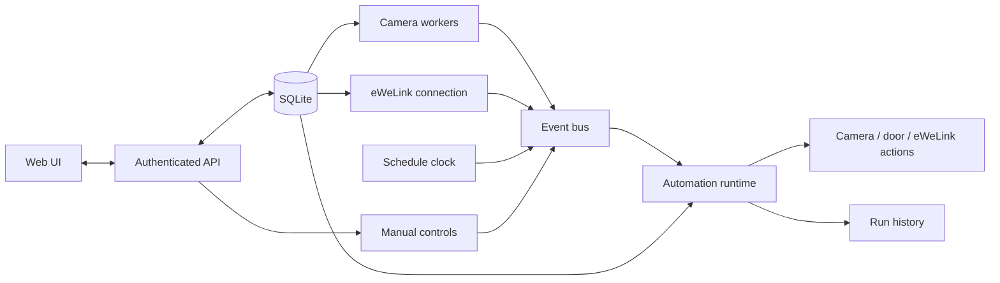
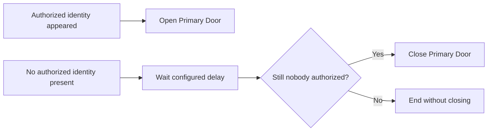

# VisionGate: New Implementation Plan

> **Status:** Implemented; final physical-device and clean-PC release checks remain  
> **Purpose:** Turn VisionGate from one fixed smart-door workflow into a small, visual automation platform.  
> **Scope of the first release:** Cameras, visual recognition, eWeLink devices, schedules, and manual controls.

This document converts the ideas in [NEW_IMPLEMENTATION.md](NEW_IMPLEMENTATION.md) into a build-ready plan. Current behavior and repository details remain documented in [PROJECT_CONTEXT.md](PROJECT_CONTEXT.md).

## 1. What changes

VisionGate keeps its existing camera dashboard and smart-door use case, while the behavior behind it is editable.

| Before | Implemented |
|---|---|
| One mostly fixed door workflow | Multiple saved visual automations |
| One configured eWeLink door device | All devices from the linked eWeLink account |
| Basic on/off or channel commands | Device-specific, typed capabilities |
| One visual embedding per identity | Multiple reviewed samples per identity |
| Hard-coded open/close rules | Editable triggers, conditions, waits, and actions |
| Desktop-oriented configuration | Desktop graph editor plus a usable phone editor |

The normal dashboard stays simple: camera, door state, open/close controls, and essential alerts. Automation editing belongs on a separate **Automations** page.

## 2. Product boundaries

### Included in the first release

- Any number of saved cameras, eWeLink devices, identities, and automations.
- Camera events based on detection, tracking, recognition, presence, and connection state.
- eWeLink state events and device actions supported by known device capabilities.
- Scheduled triggers for fixed times and repeating intervals.
- Visual automation editing.
- Temporary camera recording for reviewed identity enrollment.
- Persistent configuration, samples, devices, automations, and run history.
- The current **Primary Door** concept for a simple dashboard and safe migration.
- Existing HTTP port `83`, authentication, CSRF protection, and trusted-host checks.
- CPU-only operation as well as optional GPU acceleration.

### Deliberately excluded for now

- MQTT, generic webhooks, arbitrary HTTP requests, and third-party plugin nodes.
- User-written Python, JavaScript, expressions, or raw eWeLink JSON commands.
- Permanent storage or download of enrollment recordings.
- Resuming an automation that was interrupted by an application restart.
- Cyclic graphs or infinite loops.

These exclusions keep the first version understandable and reduce security and reliability risks.

## 3. Target architecture



The event bus can remain an in-process Python component. A separate message broker is unnecessary for a single VisionGate installation.

## 4. Locked design decisions

| Area | Decision |
|---|---|
| First integrations | Cameras and eWeLink only |
| Graph type | Directed acyclic graph; cycles are rejected |
| Variables | Typed scalar values that exist only during one run |
| Conditions | Visual rule builder; no scripts or free-form expressions |
| Schedules | Visual daily/weekly times or fixed intervals; no cron syntax required |
| Same-automation concurrency | Configurable `1–16`, default `4` |
| Device command concurrency | Commands to the same physical device are serialized |
| Desktop editor | Node canvas with connections, pan, zoom, palette, and inspector |
| Phone editor | Equivalent ordered card/list and branch editor |
| Unknown eWeLink features | Saved and shown read-only; never sent as arbitrary commands |
| Enrollment media | Temporary frames, removed after commit, cancel, expiry, or restart |
| Recognition samples | Append across sessions; manage and delete samples individually |
| Restart behavior | Active runs become `canceled`; stale waits do not resume |
| Existing door flow | Migrated into one editable default automation |

## 5. Visual automation model

### 5.1 Shapes

| Visual element | Meaning | Examples |
|---|---|---|
| Square device node | Starts from or acts on a device | Camera, eWeLink relay, Primary Door |
| Diamond condition | Chooses a branch | Identity is authorized; door is still open |
| Arrow | Carries execution to the next node | Success, false branch, failure branch |
| Step chip on an arrow | Performs a small transition step | Wait 10 seconds; set variable |

Each automation has a name, enabled state, revision, concurrency limit, nodes, edges, and saved canvas positions.

### 5.2 Node categories

#### Triggers

- **Authorized identity appeared** on a selected camera.
- **Authorized identity disappeared** from a selected camera.
- **No authorized identity present** on a selected camera.
- **Object class appeared/disappeared:** person, car, motorcycle, or bicycle.
- **Camera online/offline.**
- **eWeLink property changed**, such as a channel becoming on or a sensor value changing.
- **eWeLink device online/offline.**
- **Schedule activator:** starts the automation at a chosen time every day or on selected weekdays, or repeatedly every chosen number of minutes, hours, or days.
- **Manual trigger** from the UI or authenticated API.

##### Schedule activator behavior

The schedule activator provides two simple modes, covering loops such as every day at `03:00` or every `3` minutes:

| Mode | User input | Example |
|---|---|---|
| Time of day | Time, every day or selected weekdays, and time zone | Every day at `03:00` |
| Repeat interval | Whole number and minutes/hours/days unit | Every `3` minutes |

- Each scheduled occurrence starts a new automation run; the repetition belongs to the activator and does not create a cycle inside the graph.
- Time-of-day schedules use a saved IANA time zone, defaulting to the browser's local zone. This avoids unreliable non-IANA Windows server zone names while saving an explicit, portable zone in every trigger.
- Schedule precision is one minute. Repeat intervals may range from `1` minute to `365` days.
- The next due time is persisted in UTC and shown in the automation editor in the selected local time zone.
- After an application restart or period offline, missed occurrences are skipped rather than replayed. VisionGate calculates the next future occurrence.
- A repeated local time during the daylight-saving fall-back transition fires once. A nonexistent spring-forward time fires at the next valid local minute.
- Normal automation concurrency limits still apply. A scheduled run is logged as `dropped` if its limit is already full.

#### Conditions

Conditions are assembled from fields, operators, and values in the UI.

Examples:

- Identity authorization `is` authorized.
- Camera `is` online.
- Authorized targets present `equals` zero.
- Primary Door state `is` open.
- eWeLink channel 1 `is` on.
- Run variable `close_required` `equals` true.

Supported value types are Boolean, number, short text, device reference, camera reference, identity reference, and enum. Operators are limited by the selected field type.

#### Actions

- Open, close, or query the **Primary Door**.
- Turn a supported eWeLink channel on or off.
- Send a supported momentary/inching command.
- Set supported light, cover, enum, or numeric properties.
- Query or refresh an eWeLink device state.
- Enable or disable camera processing where the current camera service supports it.
- Write a run event to the application log.

Every action produces a success or failure result so the graph can branch safely.

### 5.3 Edge steps

An edge may contain ordered transition steps:

1. **Wait:** pause from `0` to `86,400` seconds.
2. **Set variable:** store a typed scalar in the current run context.

Variables are not stored between runs. When execution branches, each branch receives a copy of the current context so one branch cannot unexpectedly change another.

### 5.4 Runtime rules

1. A matching event starts an enabled automation.
2. The runtime checks the automation's concurrency limit.
3. It creates a run with the automation revision and event snapshot.
4. It follows outgoing edges, evaluates conditions, and executes transition steps and actions.
5. Independent branches may run in parallel.
6. Commands for the same physical device pass through one per-device lock.
7. Every node records its result and sanitized error message.
8. The final state is `completed`, `failed`, `canceled`, or `dropped`.

If the concurrency limit has been reached, the new run is dropped and logged rather than queued indefinitely. The latest `1,000` run summaries are retained. On startup, the scheduler skips missed occurrences, calculates each enabled schedule's next future run, and does not replay delayed hardware commands.

### 5.5 Validation before save or enable

The server, not only the browser, must reject a graph with:

- A cycle.
- No trigger or more than one trigger in a disconnected execution path.
- A missing camera, device, identity, node, or edge reference.
- An action unsupported by the selected device.
- A condition/operator/value type mismatch.
- An invalid schedule time, weekday selection, time zone, interval, or unit.
- A wait outside `0–86,400` seconds.
- An invalid concurrency limit.
- An unreachable node.

Saving a draft may allow incomplete nodes, but enabling it may not.

### 5.6 Stored graph contract

The database stores a versioned JSON document so the editor and runtime share one contract:

```json
{
  "schema_version": 1,
  "name": "Open for authorized target",
  "enabled": true,
  "revision": 3,
  "max_concurrent_runs": 4,
  "nodes": [
    {
      "id": "recognized",
      "kind": "trigger.camera.authorized_appeared",
      "config": {"camera_id": 1},
      "position": {"x": 80, "y": 120}
    },
    {
      "id": "open",
      "kind": "action.primary_door.open",
      "config": {},
      "position": {"x": 380, "y": 120}
    }
  ],
  "edges": [
    {
      "id": "recognized-open",
      "from": "recognized",
      "to": "open",
      "outcome": "success",
      "steps": []
    }
  ]
}
```

This is a contract example, not the final database schema or a promise to expose secrets in JSON.

## 6. Default smart-door automation

The current hard-coded behavior becomes a default automation with two event paths:



Required behavior:

- A confirmed, authorized match opens the configured door.
- The close timer starts only after the last authorized identity is no longer seen.
- Presence is checked again after the wait.
- A newly seen authorized identity cancels the practical effect of the pending close.
- A manual open does **not** automatically close unless its manual automation explicitly requests that behavior.
- Existing channels, timings, LAN/cloud preferences, and credentials are migrated without changing their meaning.

The old hard-coded recognition and auto-close path is removed only after this automation has been created successfully in the same database transaction.

## 7. eWeLink device inventory

### 7.1 Import and synchronization

After the existing eWeLink account sign-in, VisionGate imports every visible device and stores:

- Display name, model, device ID, device key, and UIID.
- LAN host/port and cloud availability where known.
- Current parameter/state snapshot.
- Derived capabilities.
- Online state and last-seen/last-sync times.

The account password is never saved. Existing token and region handling remains. API responses and logs must redact device keys, tokens, passwords, and camera credentials.

Refreshing devices performs an upsert. A device missing from a later refresh is marked unavailable, not deleted, because automations may still reference it.

### 7.2 State updates

- Prefer a live eWeLink cloud connection for state changes.
- Reconnect with bounded exponential backoff.
- Reconcile through the REST/device-list path every `60` seconds.
- Prefer LAN control for supported devices; fall back to cloud when configured and necessary.
- Always query the actual state when the dashboard opens instead of assuming the last command succeeded.

### 7.3 Typed capabilities

| Capability | Example UI control |
|---|---|
| Switch/channel | On/off toggle and action node |
| Button/inching | Momentary action |
| Binary sensor | Read-only state and condition |
| Numeric sensor | Read-only value and comparison |
| Light | On/off plus supported brightness/color fields |
| Cover | Open, close, stop, and supported position |
| Numeric setting | Bounded number input |
| Enum setting | Select input containing known values |
| Online state | Read-only status, trigger, and condition |

Unknown parameters remain visible in a read-only diagnostics section. VisionGate must not offer a raw JSON command box.

Capability mapping can follow the established open-source SonoffLAN device registry and cloud behavior while keeping VisionGate's own small typed model:

- [SonoffLAN device registry](https://github.com/AlexxIT/SonoffLAN/blob/master/custom_components/sonoff/core/devices.py)
- [SonoffLAN eWeLink cloud client](https://github.com/AlexxIT/SonoffLAN/blob/master/custom_components/sonoff/core/ewelink/cloud.py)

## 8. Multi-sample identity enrollment

### 8.1 User flow

1. Choose a camera and press **Record samples**.
2. VisionGate captures a temporary, low-rate sequence while normal detection/tracking continues.
3. Stop recording and review it with a timeline.
4. Click detected boxes in useful frames.
5. Choose an existing identity or create a new one.
6. Toggle individual proposed samples on or off.
7. Commit the selected samples or cancel the session.

This allows a user to add missed angles, clothing views, bicycles, motorcycles, or vehicles without relying on license plates.

### 8.2 Capture defaults and limits

| Setting | Default/limit |
|---|---|
| Capture rate | `4` JPEG frames per second |
| Maximum duration | `120` seconds |
| Maximum frame width | `960` pixels |
| Session expiry | `60` minutes idle |
| Samples per identity | Maximum `64` |
| Stored annotations | Normalized boxes, track IDs, class predictions, and server-side embeddings |

Temporary files are deleted on commit, cancel, idle expiry, or application startup. They are not downloadable or kept as surveillance archives.

### 8.3 Sample safety and quality

- A sample must have the same object class as its identity.
- Near-identical samples are rejected using embedding similarity.
- Samples append across enrollment sessions.
- The UI shows thumbnails and a sample count.
- A user can delete an individual sample, except the last remaining sample for an identity.
- Embeddings are generated server-side from the original crop, not browser screenshots.

### 8.4 Matching behavior

For each detected object:

1. Compare its normalized embedding with every compatible saved sample.
2. Use the highest sample similarity as that identity's score.
3. Apply the existing threshold and best-versus-second-best margin.
4. Apply the existing consecutive-confirmation requirement and cooldown.
5. Emit an authorized event only after all checks pass.

The existing model remains a visual ReID aid, not biometric proof. Users should add varied samples and keep manual control available.

## 9. Persistence and migration

SQLite remains the right database for one local VisionGate server. No external database service is required.

### 9.1 Additive tables

| Table | Purpose | Important fields |
|---|---|---|
| `profile_samples` | Multiple visual samples per identity | profile ID, class, embedding, thumbnail, created time |
| `ewelink_devices` | Full imported inventory | IDs, UIID, model, encrypted/sensitive fields as currently handled, capabilities, state, availability |
| `automations` | Versioned graph documents and schedule state | name, enabled, revision, graph JSON, next run UTC, timestamps |
| `automation_runs` | Recent execution summaries | automation/revision, trigger, state, timestamps, sanitized result |

Exact columns should follow the repository's existing migration and SQLite helper patterns instead of introducing an ORM.

### 9.2 Migration sequence

1. Back up the SQLite database using its existing safe backup mechanism.
2. Start one transaction.
3. Create the new additive tables and indexes.
4. Copy each legacy identity embedding into its first `profile_samples` row.
5. Keep the old embedding column temporarily for rollback compatibility.
6. Import the current configured eWeLink device into `ewelink_devices`.
7. Create the default smart-door automation from the current settings.
8. Validate the migrated graph and references.
9. Commit only if every step succeeds; otherwise roll back.

New recognition reads from `profile_samples`. Compatibility endpoints can remain for one release, but new UI code must use the new APIs.

### 9.3 Retention

- Keep all saved automations and identity samples until the user deletes them.
- Keep the most recent `1,000` automation run summaries.
- Do not store temporary enrollment frames after the session lifecycle ends.
- Mark missing eWeLink devices unavailable rather than deleting them.

## 10. API plan

All endpoints remain behind the existing login, session, CSRF, origin, and local-network rules where applicable.

### Devices

- `GET /api/devices` — combined camera and eWeLink inventory.
- `POST /api/ewelink/devices/refresh` — resync the account inventory.
- `GET /api/ewelink/devices/{id}` — redacted state and capabilities.
- `POST /api/ewelink/devices/{id}/actions/{action}` — validated typed action.
- `POST /api/ewelink/devices/{id}/test` — explicit, confirmed test action.

### Automations

- `GET /api/automations`
- `POST /api/automations`
- `GET /api/automations/{id}`
- `PUT /api/automations/{id}`
- `DELETE /api/automations/{id}`
- `POST /api/automations/{id}/validate`
- `POST /api/automations/{id}/dry-run`
- `POST /api/automations/{id}/run` — requires confirmation for live device actions.
- `GET /api/automations/{id}/runs`

### Enrollment and samples

- `POST /api/cameras/{id}/enrollment/start`
- `POST /api/enrollments/{id}/stop`
- `GET /api/enrollments/{id}` — review metadata and temporary frame references.
- `POST /api/enrollments/{id}/commit`
- `DELETE /api/enrollments/{id}` — cancel and clean up.
- `GET /api/profiles/{id}/samples`
- `DELETE /api/profiles/{profile_id}/samples/{sample_id}`

Endpoint names may be adjusted to match current route conventions, but their responsibilities and security boundaries should remain.

## 11. UI and UX

### 11.1 Main dashboard

Keep only information needed for daily door use:

- Current camera view and camera selector.
- Actual door state: open, closed, changing, unavailable, or unknown.
- Open/close controls with progress and errors.
- Essential recognition/door alerts.
- A clear link to **Automations** and **Settings**.

Statistics, detailed detector output, and routine polling belong in logs or dedicated diagnostics, not on the main page.

### 11.2 Desktop automation editor

- Palette of available triggers, conditions, devices, actions, waits, and variables.
- Schedule trigger form with native time input, weekday buttons, time-zone selection, interval value/unit, and a clear **Next run** preview.
- Native HTML nodes connected with SVG lines.
- Drag, connect, pan, zoom, keyboard navigation, and delete/undo for the current edit.
- Side inspector for the selected item.
- Visible validation errors attached to the relevant node or edge.
- Save draft, enable/disable, dry run, and confirmed live run.
- No dependency on a large graph-editing framework unless the native implementation becomes measurably unmaintainable.

### 11.3 Phone automation editor

Do not squeeze a desktop canvas onto a phone. Show:

- Trigger card first.
- Ordered action/condition cards.
- Indented true/false or success/failure branches.
- Add, edit, move, and delete controls with large touch targets.
- The same validation and features as desktop.

Both editors read and write the same `AutomationGraph v1` document.

### 11.4 eWeLink settings

Replace the single-device-oriented section with:

- Account connection state and refresh button.
- Searchable device list with name, model, online state, and last update.
- Capability-specific controls.
- **Use as Primary Door** selection and open/close channel configuration.
- Explicit test controls with confirmation and immediate result.
- Read-only diagnostics for unknown properties.

Secrets never appear after submission.

## 12. Security and operational rules

The new work must preserve the repository's existing security model:

- HTTP on port `83`, as explicitly required for this deployment.
- File-only administrator credentials; no website password-change feature.
- Scrypt password hashing, rate limiting, secure session handling appropriate to the current HTTP deployment, CSRF protection, and origin checks.
- Trusted-host configuration for the configured hostname and local access.
- eWeLink account login/import limited to local requests as currently designed.
- No secrets in API responses, browser storage, automation graphs, run history, or logs.
- Server-side capability validation for every device action.
- Confirmation before a live test or manual automation can move physical hardware.

Because public plain HTTP does not encrypt traffic, deployment documentation must continue to state the risk clearly even though port `83` remains the required mode.

## 13. Implementation order

Each phase should finish with a usable, tested vertical slice.

### Phase 1 — Data foundation

- Add the four tables and migration/rollback tests.
- Migrate legacy embeddings and the existing door configuration.
- Add typed device, graph, and sample serialization helpers using current repository patterns.

### Phase 2 — eWeLink inventory

- Import and persist every device.
- Derive typed capabilities.
- Add state refresh, redaction, unavailable-device handling, LAN preference, and cloud fallback.
- Update the settings UI and prove the 4CHPRO R2 open/close path still works.

### Phase 3 — Automation runtime

- Implement event normalization, schedule calculation, validation, runs, waits, branches, variables, limits, device locks, and restart cancellation.
- Seed and run the default smart-door automation.
- Keep the old flow available only until migration equivalence is proven.

### Phase 4 — Automation editors

- Build the desktop canvas and phone card editor over the same API.
- Add draft validation, dry run, confirmed live run, and concise history.
- Keep the main dashboard uncluttered.

### Phase 5 — Multi-sample enrollment

- Add temporary capture and cleanup.
- Add review playback, selectable boxes, sample commit, deduplication, and sample management.
- Switch matching to the multi-sample source after migration tests pass.

### Phase 6 — Release hardening

- Test installer and updater on a clean Windows computer without Python.
- Test CPU-only processing and optional NVIDIA acceleration.
- Update README, project context, security notes, and troubleshooting.
- Run the complete test suite and a final repository cleanup.

## 14. Required tests

### Migration and persistence

- Existing cameras, profiles, settings, door device, and credentials retain their meaning.
- A failed migration rolls back without partial tables or lost data.
- Every legacy profile receives one usable sample.
- Restart keeps devices, graphs, samples, and completed run history.

### Automation engine

- Cycle, missing-reference, invalid-condition, unsupported-action, and wait-limit checks.
- True/false and success/failure branches.
- Per-run variables and copied branch contexts.
- Parallel branches and configurable run caps.
- Same-device commands never overlap.
- Failed actions follow the failure path and do not crash the runtime.
- Dry runs never move hardware.
- Interrupted runs become canceled after restart.
- Daily and selected-weekday schedules fire once at the correct local time.
- Minute/hour/day intervals keep the correct cadence and respect concurrency limits.
- Daylight-saving repeated and missing times follow the documented behavior.
- Restart skips missed occurrences and persists the next future run without a catch-up burst.

### eWeLink

- Multi-device import/upsert and missing-device handling.
- UIID/capability mapping for known and unknown devices.
- Key/token/password redaction from API and logs.
- LAN success, cloud fallback, reconnect, and periodic reconciliation.
- Real 4CHPRO R2 channel 1 open and channel 2 close tests with explicit confirmation.

### Enrollment and recognition

- Capture rate, size, duration, sample, and expiry limits.
- Temporary cleanup on commit, cancel, expiry, and restart.
- Review timeline and clickable detection boxes.
- Class mismatch and near-duplicate rejection.
- Add and remove samples without deleting the final sample.
- Legacy single-sample identities still match after migration.
- Best-sample score still respects threshold, margin, confirmations, and cooldown.

### Product behavior

- Authorized arrival opens the door once.
- Close waits until the last authorized target disappears, waits the configured time, and rechecks presence.
- A returned authorized target prevents closing.
- Manual opening does not silently start the recognition close timer.
- Door state is queried when the dashboard opens.
- Main workflows work at `320px` width and with keyboard navigation.
- Installer, launcher, updater, port `83`, trusted hosts, CPU-only mode, and optional GPU mode work on a clean machine.

## 15. Acceptance checklist

The implementation is complete only when all items below are true:

- [x] Existing installations migrate automatically after a verified backup.
- [x] The default automation reproduces current safe door behavior.
- [x] Users can create, validate, dry-run, enable, disable, and inspect an automation.
- [x] Users can activate an automation every day/selected weekday at a chosen time or every chosen number of minutes, hours, or days.
- [x] Desktop and phone use the same graph document and API without losing data.
- [x] Every imported eWeLink device appears with safe controls for known capabilities.
- [x] The dashboard distinguishes changing, unavailable, unknown, and authoritative states when a sensor provides them.
- [x] Users can record, review, and add multiple visual samples without retaining the recording.
- [x] Credential and device-key redaction is enforced for HTML, client JavaScript, APIs, logs, graphs, and run history.
- [x] A restart safely cancels incomplete runs and removes temporary enrollment data.
- [x] The automated suite and real model inference pass in CPU-only and NVIDIA CUDA modes.
- [x] Authenticated login, dashboard, and phone automation editing pass at `320px` with no horizontal overflow and `44px` effective touch targets.
- [x] Authenticated desktop automation editing passes at `1440x900` with real condition diamonds, edge chips, every default node visible, and no page overflow.
- [ ] Run explicitly confirmed open/close tests on the real 4CHPRO R2 while the physical door is safe to move.
- [ ] Run the installer and updater once on a separate clean Windows PC without Python before publishing the release.

## 16. Important defaults at a glance

| Default | Value |
|---|---|
| Web mode | HTTP, port `83` |
| Automation graph | DAG only |
| Runs per automation | `4` default, configurable `1–16` |
| Schedule precision | `1` minute |
| Repeat interval | `1` minute to `365` days |
| Schedule time zone | Browser local IANA zone by default; saved per trigger |
| Missed scheduled runs | Skip and calculate the next future occurrence |
| Maximum wait | `86,400` seconds |
| Run history | Latest `1,000` summaries |
| eWeLink REST reconciliation | Every `60` seconds |
| Enrollment capture | `4 FPS`, JPEG, width up to `960px` |
| Enrollment duration | Up to `120` seconds |
| Enrollment idle expiry | `60` minutes |
| Samples per identity | Up to `64` |
| Enrollment recording retention | None after session cleanup |

## 17. Source documents

- [Original new-implementation idea](NEW_IMPLEMENTATION.md)
- [Current repository and product context](PROJECT_CONTEXT.md)
- [Existing UI research](UX_RESEARCH.md)
